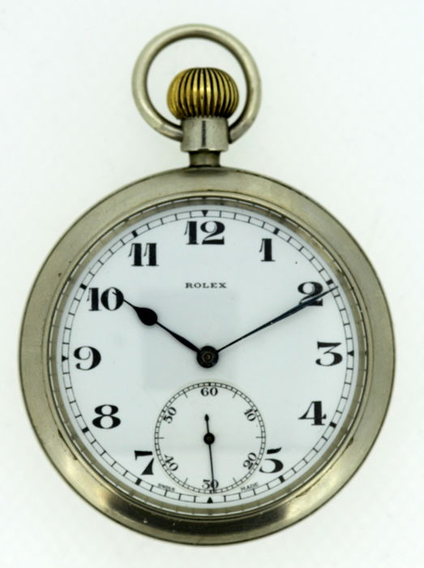
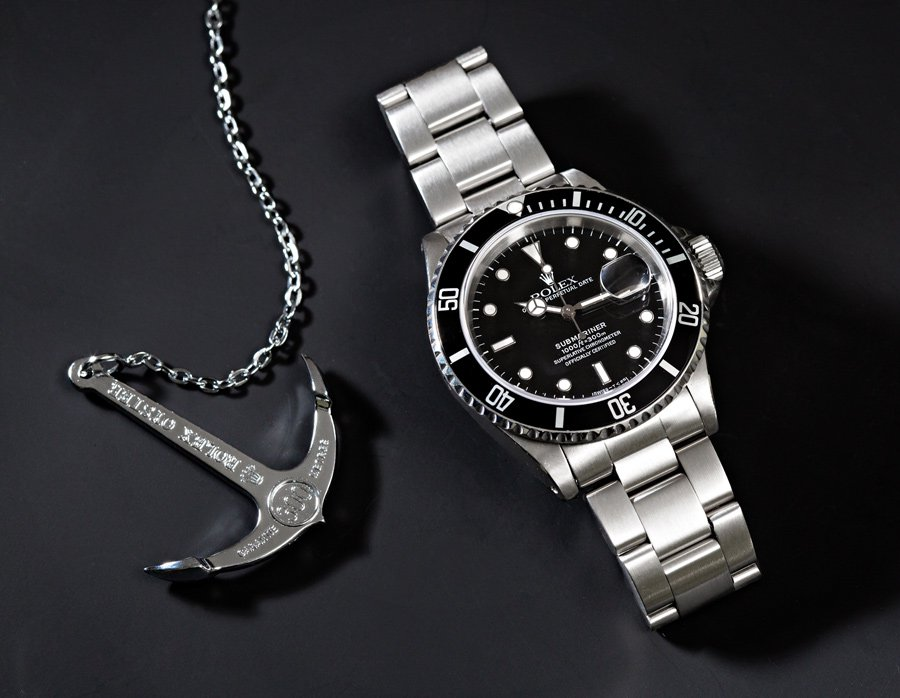
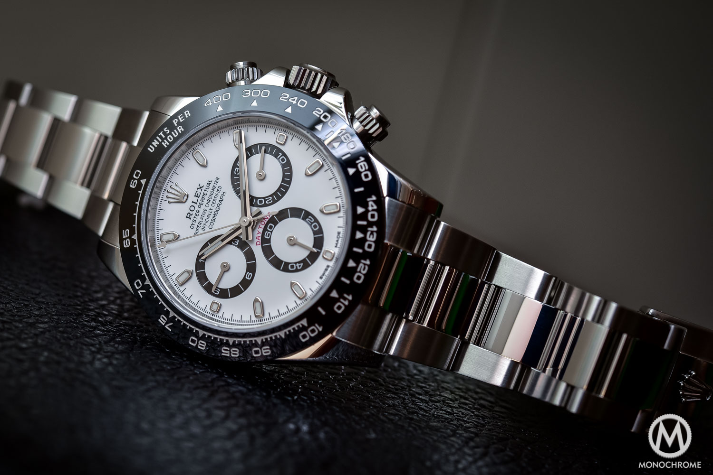
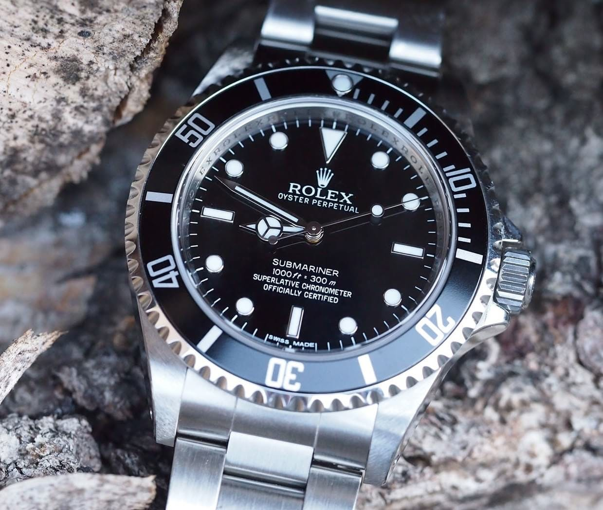

<!DOCTYPE html>
<html lang="en">
<head>
    <meta charset="UTF-8">
    <title>Title</title>
    <link rel="stylesheet" href="css/bootstrap.css">
    <nav class="navbar navbar-expand-md bg-dark fixed-top">
        
        <ul class="navbar-nav">
            <li class="nav-item">
                <a class="nav-link text-light" href="indent.html">Home</a>
            </li>
            <li class="nav-item">
                <a class="nav-link text-light" href="images.html">Images</a>
            </li>
            <li class="nav-item">
                <a class="nav-link text-light" href="contact.html">contact us</a>
            </li>
        </ul>
        <form class="form-inline ml-auto" action="/action_page.php">
            <input class="form-control mr-sm-2" type="text" placeholder="Search">
            <button class="btn btn-success" type="submit">Search</button>
        </form>
    </nav>
    
</head>

<body>

<header class="m-3 mt-3">
    <h2></h2>
</header>
<section>
    

        <h1 class="font-weight-bold text-uppercase m-3">time dynasty</h1>
        

            

                
Time is the only thing that explains everything and thus makes it   a neccesity in life.  
                     One needs a watch in various ways;like waking up or punctuality.
                       Thus the dynasty brings time closer to you.  Time is a practical convenience in modern life. Numerous standards have been set up, allowing people to coordinate events and, in general, keep their lives running smoothly.  The earth has been divided into so-called time zones that reflect the fact that high noon occurs at different times at different places on the planet.  All of these time zones are referenced to the time at the longitude of Greenwich, England.   A universal standard, coinciding almost exactly with the time at Greenwich, is known as Coordinated Universal Time (UTC). There are various other time standards.

                <button type="button" class="btn-success">Learn more</button>
            

            

                
                
            

        

    

</section>
<section>
    

        

            <!-- Indicators -->
            <ul class="carousel-indicators">
                <li data-target="#demo" data-slide-to="0" class="active"></li>
                <li data-target="#demo" data-slide-to="1"></li>
                <li data-target="#demo" data-slide-to="2"></li>
            </ul>

            <!-- The slideshow -->
            

                

                    
                

                

                    
                

                

                    
                

            

            <!-- Left and right controls -->
            <a class="carousel-control-prev" href="tryit.asp-filename=trybs_carousel.html#demo" data-slide="prev">
                
            </a>
            <a class="carousel-control-next" href="tryit.asp-filename=trybs_carousel.html#demo" data-slide="next">
                
            </a>
        

    

    

        
Rolex watches are crafted from the finest raw materials and assembled with scrupulous attention to detail.   Every component is designed, developed and produced in-house to the most exacting standards.  Invicta holds the firm belief that expertly crafted timepieces can be offered at reasonable prices.    This belief is the founding principal and still drives them today.   Still privately owned and operated, setting a criteria for exceptional standards,   Invicta maintains their objective by successfully satisfying consumers and collectors alike.   Get exceptional prices and Fast, FREE Shipping today from Princeton Watches! 

    

</section>

</body>
</html>
<!DOCTYPE html>
<html lang="en">
<head>
    <meta charset="UTF-8">
    <title>gallery</title>
    <link rel="stylesheet" href="css/bootstrap.css">
    <nav class="navbar navbar-expand-sm bg-dark fixed-top">
        
        <ul class="navbar-nav">
            <li class="nav-item">
                <a class="nav-link text-light" href="indent.html">Home</a>
            </li>
            <li class="nav-item">
                <a class="nav-link text-light" href="images.html">Images</a>
            </li>
            <li class="nav-item">
                <a class="nav-link text-light" href="contact.html">contact us</a>
            </li>
        </ul>
        <form class="form-inline ml-auto" action="/action_page.php">
            <input class="form-control mr-sm-2" type="text" placeholder="Search">
            <button class="btn btn-success" type="submit">Search</button>
        </form>
    </nav>
</head>
<body>
<section>
    

        <h2 class="text-light ml-3 m-2 align-content-center">Display</h2>
        

            

                
                
Nike  Classic, puristic, and yet exciting. Perfect style combined with contemporary minimalism. Inspired by Danish design, the CLASSIC COLLECTION represents a unique timepiece, perfectly highlighting your daily style. The polished silver-toned IP plated stainless steel case, made of pure, high quality, medical-grade stainless steel (316L), in combination with the grey-toned IP plated modern Milanese mesh strap, provides the classic BERING look.   $2700

                <a href="#" type="button" class="btn btn-outline-dark">Buy</a>
            

            

                
                
Seiko   Classic, puristic, and yet exciting. Perfect style combined with contemporary minimalism. Inspired by Danish design, the CLASSIC COLLECTION represents a unique timepiece, perfectly highlighting your daily style. The polished silver-toned IP plated stainless steel case, made of pure, high quality, medical-grade stainless steel (316L), in combination with the grey-toned IP plated modern Milanese mesh strap, provides the classic BERING look.$2000

                <a href="#" type="button" class="btn btn-outline-dark">Buy</a>
            

            

                
                
Rolex   Classic, puristic, and yet exciting. Perfect style combined with contemporary minimalism. Inspired by Danish design, the CLASSIC COLLECTION represents a unique timepiece, perfectly highlighting your daily style. The polished silver-toned IP plated stainless steel case, made of pure, high quality, medical-grade stainless steel (316L), in combination with the grey-toned IP plated modern Milanese mesh strap, provides the classic BERING look.$3000

                <a href="#" type="button" class="btn btn-outline-dark">Buy</a>
            

        

        

            

                
                
Tagheur   Classic, puristic, and yet exciting. Perfect style combined with contemporary minimalism. Inspired by Danish design, the CLASSIC COLLECTION represents a unique timepiece, perfectly highlighting your daily style. The polished silver-toned IP plated stainless steel case, made of pure, high quality, medical-grade stainless steel (316L), in combination with the grey-toned IP plated modern Milanese mesh strap, provides the classic BERING look.$2200

                <a href="#" type="button" class="btn btn-outline-dark">Buy</a>
            

            

                
                
Gucci   Classic, puristic, and yet exciting. Perfect style combined with contemporary minimalism. Inspired by Danish design, the CLASSIC COLLECTION represents a unique timepiece, perfectly highlighting your daily style. The polished silver-toned IP plated stainless steel case, made of pure, high quality, medical-grade stainless steel (316L), in combination with the grey-toned IP plated modern Milanese mesh strap, provides the classic BERING look.$2000

                <a href="#" type="button" class="btn btn-outline-dark">Buy</a>
            

            

                
                
Omega   Classic, puristic, and yet exciting. Perfect style combined with contemporary minimalism. Inspired by Danish design, the CLASSIC COLLECTION represents a unique timepiece, perfectly highlighting your daily style. The polished silver-toned IP plated stainless steel case, made of pure, high quality, medical-grade stainless steel (316L), in combination with the grey-toned IP plated modern Milanese mesh strap, provides the classic BERING look.$2250

                <a href="#" type="button" class="btn btn-outline-dark">Buy</a>
            

        

    

</section>

</body>
</html>
<!DOCTYPE html>
<html lang="en">
<head>
    <meta charset="UTF-8">
    <title>Title</title>
    <link rel="stylesheet" href="css/bootstrap.css">
    <nav class="navbar navbar-expand-sm bg-dark fixed-top">
        
        <ul class="navbar-nav">
            <li class="nav-item">
                <a class="nav-link text-light" href="indent.html">Home</a>
            </li>
            <li class="nav-item">
                <a class="nav-link text-light" href="images.html">Images</a>
            </li>
            <li class="nav-item">
                <a class="nav-link text-light" href="contact.html">contact us</a>
            </li>
        </ul>
        <form class="form-inline ml-auto" action="/action_page.php">
            <input class="form-control mr-sm-2" type="text" placeholder="Search">
            <button class="btn btn-success" type="submit">Search</button>
        </form>
    </nav>
</head>
<body>
<section>
    

        <h2>Contact us</h2>
        
Your feedback is highly valued.

        

            

                <label for="usr">Name</label>
                <input type="text" id="usr" placeholder="Name">
            

        

        

            

                <label for="Email">Email</label>
                <input type="email" id="Email" placeholder="Email">
            

        

        

            <label for="fb">Comment</label>
            <textarea name="feedback" id="fb" cols="20" rows="10"></textarea>
        

        <button type="submit" class="btn btn-primary">submit</button>
    

</section>
<section>
    <footer class="container-fluid bg-dark text-center">
        

            <h1 class="text-light">social media</h1>
            
like,tweet and follow.

        

        

            

                
            

            

                
            

            

                
            

        

        
&copy;copyright 2019-phpstorm

    </footer>
</section>

</body>
</html>
